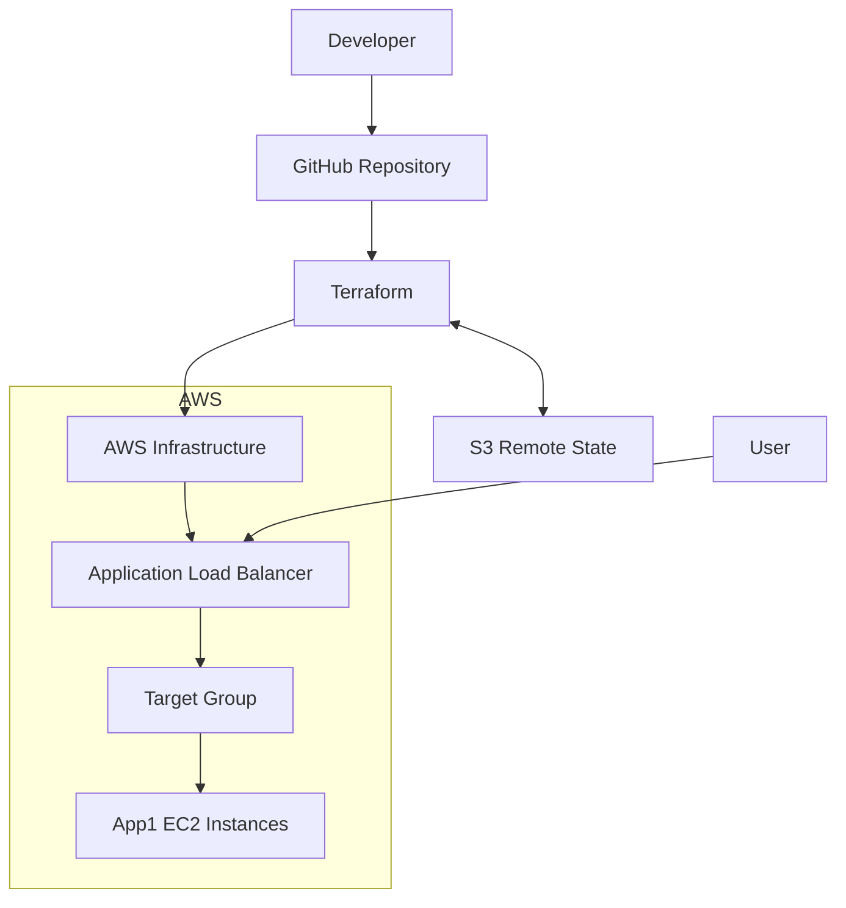

```mermaid
flowchart TD
    A[Developer] --> B[GitHub Repository]
    B --> C[Terraform]
    C --> D[AWS Infrastructure]
    C <--> E[S3 Remote State]

    subgraph AWS
        D --> F[Application Load Balancer]
        F --> G[Target Group]
        G --> H[App1 EC2 Instances]
    end

    I[User] --> F
```
